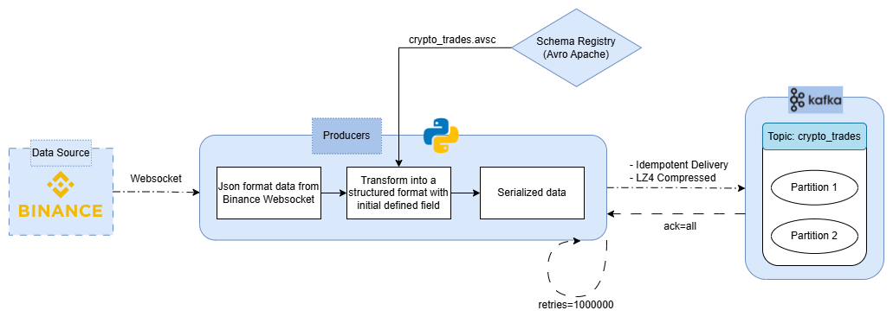

<div align="center">

# CRYPTO REAL-TIME PIPELINE

**An End-to-End Real-Time Data Engineering Pipeline for Cryptocurrency Trading Analytics**

[](LICENSE)
[](docker-compose.yml)
[](producers/)
[](config/kafka.py)
[](spark_jobs/)
[](config/postgres.py)
[](dbt/)
[](dags/)
[](monitoring/grafana/)
[](monitoring/prometheus/)

[](https://www.youtube.com/watch?v=GQ4aimMpMro)

This is a video demo of the project in action, just click the picture above to watch.

</div>

---

## Table of Contents

- [Overview](#overview)
- [Architecture](#architecture)
- [Technology Stack](#technology-stack)
- [Project Structure](#project-structure)
- [Data Flow](#data-flow)
- [Producer — Real-Time Ingestion](#producer--real-time-ingestion)
- [Spark Structured Streaming — Stream Processing](#spark-structured-streaming--stream-processing)
- [dbt — Transformation Layer (Medallion Architecture)](#dbt--transformation-layer-medallion-architecture)
- [Business Analytics Dashboard](#business-analytics-dashboard)
- [Monitoring & Alerting](#monitoring--alerting)
- [Getting Started](#getting-started)
- [Documentation Index](#documentation-index)
- [License](#license)

---

## Overview


Crypto Real-Time Pipeline is an end-to-end data engineering project built to ingest, process, transform, and visualize live cryptocurrency trade data in real time. 

The system connects to the **Binance WebSocket API** to capture raw trade events across multiple trading pairs, serializes them with **Apache Avro** validated against a **Confluent Schema Registry**, and publishes them to **Apache Kafka**. From Kafka, **Apache Spark Structured Streaming** consumes the data stream, deserializes the binary Avro payloads, and performs windowed aggregations (1-minute tumbling windows with watermarking) to produce OHLCV (Open, High, Low, Close, Volume) candles. These aggregated candles are written in parallel to a **PostgreSQL** data warehouse (Raw layer) and archived as Parquet files in a **MinIO/S3** data lake for historical backfilling.

On the transformation side, **dbt (Data Build Tool)** implements a full **Medallion Architecture** within PostgreSQL — moving data through Bronze (deduplication), Silver (gap-filling, technical indicator calculation including SMA and RSI), and Gold (business-level marts with trade signals, market breadth, and periodic performance metrics). All Gold marts are served directly to **Grafana** dashboards that provide real-time market analytics.

The entire pipeline is monitored end-to-end via **Kafka Exporter** (exposes broker and topic metrics), **JMX Exporter** agents are attached to Spark Driver and Executor JVMs to expose streaming throughput, batch latency, state store size, and heap memory metrics, all scraped by **Prometheus** and visualized in specialized **Grafana** monitoring dashboards. An alerting system sends email notifications (via SMTP) when critical conditions are detected — such as Spark job failures, high processing latency, or JVM memory pressure.

Everything is orchestrated by **Apache Airflow**, containerized with **Docker Compose**, and designed to run locally as a self-contained environment.

---

## Architecture

The system follows a layered architecture that separates concerns across ingestion, stream processing, transformation, serving, and monitoring.

<!-- Replace with your architecture diagram -->


For a detailed sequence diagram and in-depth architecture analysis, see [docs/architecture/data_flow.md](docs/architecture/data_flow.md).

---

## Technology Stack

| Layer | Technology | Version / Details |
| :--- | :--- | :--- |
| **Data Source** | Binance WebSocket API | `@trade` streams, multiple symbols |
| **Ingestion** | Python, `confluent_kafka`, `websocket-client` | Avro serialization, Schema Registry |
| **Message Broker** | Apache Kafka (Confluent) | 7.4.0, with Zookeeper |
| **Schema Management** | Confluent Schema Registry | Avro schema |
| **Stream Processing** | Apache Spark (PySpark) | 3.5.0, Structured Streaming |
| **Data Warehouse** | PostgreSQL | 13, JDBC sink |
| **Data Lake** | MinIO (S3-compatible) | Parquet format, partitioned by date/symbol |
| **Transformation** | dbt Core (dbt-postgres) | 1.10.0, Medallion Architecture |
| **Orchestration** | Apache Airflow | LocalExecutor |
| **Visualization** | Grafana | Dashboards + Alerting (SMTP) |
| **Metrics Collection** | Prometheus | Scrapes Kafka Exporter + JMX Exporter |
| **Infrastructure** | Docker, Docker Compose | Fully containerized (15+ services) |

---

## Project Structure

```text
crypto-realtime-pipeline/
├── config/                         # Python config modules (kafka, postgres, s3, spark, dbt)
│   └── schemas/
│       └── crypto_trades.avsc      # Avro schema definition (TradeEvent)
├── dags/                           # Airflow DAGs
│   ├── crypto_trades_realtime.py   # Main pipeline: Producer + Spark Streaming
│   ├── dbt_crypto_transform.py    # Scheduled dbt transformation
│   ├── ops_init_infrastructure.py  # Infrastructure setup DAG
│   ├── ops_check_connectivity.py   # Connectivity health check DAG
│   └── utils/                      # Shared DAG utilities
├── dbt/                            # dbt project
│   ├── models/
│   │   ├── staging/                # Bronze layer (Views)
│   │   ├── intermediate/           # Silver layer (Incremental)
│   │   └── marts/                  # Gold layer (Incremental)
│   ├── seeds/                      # Reference data (crypto_symbols.csv)
│   ├── dbt_project.yml
│   └── profiles.yml
├── docker/                         # Custom Dockerfiles
│   ├── Dockerfile.airflow
│   └── Dockerfile.spark
├── docs/                           # Full documentation
│   ├── architecture/               # Data flow, producers, spark jobs, dbt models
│   ├── business/                   # Dashboard metric definitions
│   ├── guides/                     # Installation, configuration, runbook
│   └── monitoring/                 # Monitoring dashboards, alerting rules
├── monitoring/                     # Monitoring infrastructure
│   ├── grafana/provisioning/       # Datasources, dashboards, alerting (IaC)
│   ├── prometheus/prometheus.yml   # Scrape configuration
│   └── spark_jmx/                  # JMX Exporter config for Spark
├── producers/                      # Kafka producer application
│   ├── main.py                     # Entry point
│   ├── connectors/                 # Binance, Kafka, Schema Registry clients
│   └── domain/                     # Data transformer
├── spark_jobs/                     # Spark Structured Streaming jobs
│   ├── jobs/
│   │   ├── ingest_postgres.py      # Kafka → PostgreSQL (OHLCV aggregation)
│   │   └── ingest_minio.py         # Kafka → MinIO/S3 (Parquet archive)
│   ├── dependencies/               # Shared connectors, session builder, DI container
│   └── tests/
├── docker-compose.yml              # Full stack orchestration (15+ services)
└── .env.example                    # Environment variable template
```

---

## Data Flow

The pipeline processes data through three phases:

1. **Real-Time Ingestion** — Python producer captures Binance WebSocket trade events, serializes with Avro (Schema Registry), and publishes to Kafka with idempotent delivery.
2. **Stream Processing** — Spark Structured Streaming consumes from Kafka, aggregates into 1-minute OHLCV candles (tumbling windows + watermarking), and writes to PostgreSQL and MinIO/S3 in parallel.
3. **Scheduled Transformation** — dbt runs daily via Airflow, transforming raw data through the Medallion Architecture (Bronze → Silver → Gold) into analytics-ready marts.

> **Deep dive:** [Data Flow & Architecture Deep Dive](docs/architecture/data_flow.md) — sequence diagrams, processing semantics, storage layout, and full component integration.

---

## Producer — Real-Time Ingestion



The producer follows a **Source → Transform → Sink** pattern: connects to Binance WebSocket `@trade` streams for 10 crypto pairs, validates and serializes trade events using Avro + Schema Registry, and publishes to Kafka with idempotent delivery (`acks=all`, LZ4 compression).

| Component | File | Responsibility |
| :--- | :--- | :--- |
| **Binance Client** | `producers/connectors/binance_client.py` | WebSocket connection with auto-reconnection (5s retry) |
| **Transformer** | `producers/domain/transformer.py` | Validates JSON, extracts fields, appends `processing_time` |
| **Schema Registry** | `producers/connectors/schema_registry.py` | Avro serialization with Confluent wire format |
| **Kafka Client** | `producers/connectors/kafka_client.py` | Idempotent producer with LZ4 compression |

> **Deep dive:** [Producers Documentation](docs/architecture/producers.md) — Avro schema definition, wire format, Kafka config rationale, error handling.

---

## Spark Structured Streaming — Stream Processing


Spark Structured Streaming consumes from Kafka, strips the 5-byte Confluent Avro header, deserializes trade events, and writes to two sinks concurrently:

| Job | Sink | Processing | Output |
| :--- | :--- | :--- | :--- |
| `ingest_postgres.py` | PostgreSQL `raw.candles_log` | 1-min OHLCV aggregation (watermark 1 min) | JDBC, `update` mode |
| `ingest_minio.py` | MinIO/S3 | Raw trades (no aggregation) | Parquet, partitioned by date/symbol |

Key design: Dependency Injection container for connectors, checkpointing on S3 for fault tolerance, dynamic schema from Registry, and JMX monitoring for Prometheus.

> **Deep dive:** [Spark Jobs Documentation](docs/architecture/spark_jobs.md) — cluster config, Avro handling, windowing logic, connector architecture, fault tolerance.

---

## dbt — Transformation Layer (Medallion Architecture)

dbt transforms raw streaming data into analytics-ready tables within PostgreSQL using a three-layer **Medallion Architecture**:


| Layer | Schema | Key Models | Purpose |
| :--- | :--- | :--- | :--- |
| **Bronze** | `bronze` | `stg_binance__candles` | Deduplication, initial cleaning (view) |
| **Silver** | `silver` | `int_crypto__continuous_candles`, `int_crypto__technical_indicators`, `int_crypto__daily_candles` | Gap-filling, SMA/RSI calculation, daily aggregation (incremental) |
| **Gold** | `gold` | `mart_crypto__technical_analysis`, `mart_market__market_breadth`, `mart_crypto__periodic_performance`, `dim_crypto__symbols` | Trade signals, market sentiment, performance metrics (incremental) |

All Silver and Gold models use incremental materialization with lookback windows for indicator accuracy. Orchestrated by Airflow via astronomer-cosmos with tests after each model.


In Airflow:


> **Deep dive:** [dbt Transformation Guide](docs/architecture/dbt_models.md) — SQL logic, incremental strategies, data quality tests, model catalog.

---

## Business Analytics Dashboard

The Grafana business dashboard is organized in a **"Macro to Micro"** hierarchy for market analysis:


### Row 1: Macro View — Market Health

| Panel | Type | Description |
| :--- | :--- | :--- |
| **Market Sentiment** | Stat | Psychological state based on aggregated RSI (Extreme Greed / Greed / Neutral / Fear / Extreme Fear) |
| **Bitcoin Dominance** | Gauge | BTC's share of total trading volume — rising signals risk-off, falling signals altcoin season |
| **Market Breadth** | Gauge | Percentage of assets trading above SMA(20) — >80% strong uptrend, <20% broad collapse |
| **Total Volume** | Bar Chart | Aggregate USDT trading volume across all tracked assets |
| **Data Lag** | Stat | Pipeline latency — time between now and the latest data point |
| **Data Completeness** | Stat | Count of 1-minute candles received in the last hour (target: 60) |

### Row 2: Micro View — Asset Analysis

| Panel | Type | Description |
| :--- | :--- | :--- |
| **Price Action & SMA** | Candlestick | OHLC chart overlaid with SMA(5) and SMA(20) trendlines |
| **RSI (14)** | Time Series | Momentum oscillator — overbought >70, oversold <30 |

### Row 3: Actionable Insights

| Panel | Type | Description |
| :--- | :--- | :--- |
| **Top Movers** | Table | Asset rankings by weekly/monthly returns and daily volatility |
| **Live Signals** | Table | Real-time algorithmic trade recommendations (STRONG BUY / BUY / SELL / STRONG SELL) |
| **Coin Info** | Table | Static reference data for the selected asset |

For detailed metric definitions and interpretation guidance, see [docs/business/business_dashboard.md](docs/business/business_dashboard.md).

---

## Monitoring & Alerting

The pipeline is monitored end-to-end with Prometheus metrics collection and Grafana visualization:

| Component | Role | Port |
| :--- | :--- | :--- |
| **Prometheus** | Metrics aggregation and storage | `9090` |
| **Kafka Exporter** | Broker/topic metrics (messages/sec, consumer lag) | `9308` |
| **JMX Exporter** (Driver / Executor) | Spark streaming + JVM metrics (heap, GC, throughput) | `9101` / `9102` |
| **Grafana** | Monitoring dashboards + email alerting (SMTP) | `3000` |

Three alert rules cover availability (`Spark Job Stopped`), performance (`Spark Latency High`), and stability (`JVM Memory Critical`), with SMTP email notifications and 4-hour repeat intervals.


> **Deep dive:** [Monitoring Dashboards](docs/monitoring/monitoring_dashboard.md) — panel interpretation, dashboard structure | [Alerting Guide](docs/monitoring/alerting_guide.md) — alert rules, lifecycle, recovery procedures.

---

## Getting Started

### Prerequisites

| Requirement | Minimum | Recommended |
| :--- | :--- | :--- |
| **Docker Engine** | 20.10+ | Latest |
| **Docker Compose** | 2.0+ | Latest |
| **RAM** | 8 GB | 16 GB |
| **CPU** | 2 vCPUs | 4 vCPUs |

### Quick Start

#### Step 1: Clone the repository and set up environment variables

```bash
git clone https://github.com/MinhHuy1507/crypto-realtime-pipeline
cd crypto-realtime-pipeline
cp .env.example .env
```

Configure SMTP for Grafana email alerts — see [Installation Guide: Environment Configuration](docs/guides/installation.md) for Gmail App Password setup.

#### Step 2: Build and start the services
```bash
# 1. Configure dbt
cp dbt/profiles.yml.example dbt/profiles.yml

# 2. Build and launch (5-15 min first build)
docker-compose up -d --build

# 3. Verify all services are running
docker ps                       # All 15+ containers should be Up/Healthy
```

### Service Access

| Service | URL | Credentials |
| :--- | :--- | :--- |
| **Airflow UI** | http://localhost:8080 | `airflow` / `airflow` |
| **Grafana** | http://localhost:3000 | `admin` / `admin` |
| **Spark Master** | http://localhost:8090 | — |
| **MinIO Console** | http://localhost:9001 | `minioadmin` / `minioadmin123` |
| **Kafka UI** | http://localhost:8088 | — |
| **Prometheus** | http://localhost:9090 | — |

### Running the Pipeline

1. **Infrastructure:** Trigger `ops_check_connectivity` → `ops_init_infrastructure` in Airflow UI
2. **Streaming:** Unpause `crypto_trades_realtime`
3. **Transformation:** Unpause `dbt_crypto_transform`
4. **Shutdown:** Pause all DAGs → `docker-compose stop`
5. **Full Reset:** `docker-compose down -v` (wipes all data)

> **Full guides:** [Installation Guide](docs/guides/installation.md) | [Configuration Reference](docs/guides/configuration.md) | [Operations Runbook](docs/guides/runbook.md) | [Airflow Workflows](docs/architecture/airflow_workflows.md)

---

## Documentation Index

| Document | Description |
| :--- | :--- |
| [Architecture Deep Dive](docs/architecture/data_flow.md) | End-to-end data flow, sequence diagrams, processing semantics |
| [Producers](docs/architecture/producers.md) | Producer design, schema validation, Kafka client configuration |
| [Spark Jobs](docs/architecture/spark_jobs.md) | Streaming jobs, connectors, dependency injection, fault tolerance |
| [dbt Models](docs/architecture/dbt_models.md) | Full model catalog, incremental strategies, SQL logic |
| [Airflow Workflows](docs/architecture/airflow_workflows.md) | DAG descriptions, scheduling, task dependencies |
| [Installation Guide](docs/guides/installation.md) | Step-by-step deployment guide |
| [Configuration Reference](docs/guides/configuration.md) | All config files, ports, resource limits |
| [Operations Runbook](docs/guides/runbook.md) | Start/stop procedures, maintenance, troubleshooting |
| [Monitoring Dashboards](docs/monitoring/monitoring_dashboard.md) | Dashboard panels and interpretation |
| [Alerting Guide](docs/monitoring/alerting_guide.md) | Alert rules, lifecycle, notification and recovery |
| [Business Dashboard](docs/business/business_dashboard.md) | Metric definitions, financial indicators, signal logic |

---

## License

This project is licensed under the **Mozilla Public License Version 2.0** — see the [LICENSE](LICENSE) file for details.