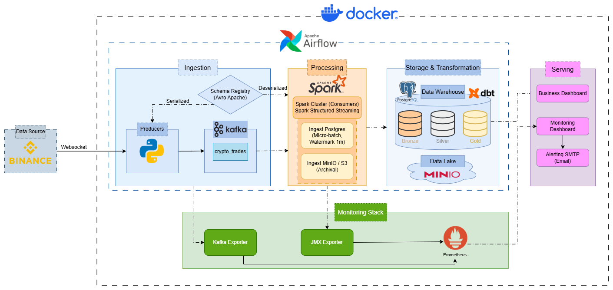

# Data Flow & Architecture Deep Dive

## 1. Overview

This document provides a technical deep dive into the data pipeline. It details how data flows from the Binance WebSocket API through the ingestion, processing, and transformation layers to the final visualization. Including data serialization standards, stream processing semantics, incremental transformation logic, orchestration, and monitoring.


| Layer | Technology | Role |
|---|---|---|
| Data Source | Binance WebSocket | Real-time trade stream for 10 crypto pairs |
| Ingestion | Python Producer, Confluent Schema Registry, Apache Kafka | Serialize & buffer trade events |
| Processing | Apache Spark Structured Streaming | Deserialize, aggregate into 1-min OHLCV candles, dual-sink |
| Storage | PostgreSQL (Data Warehouse), MinIO/S3 (Data Lake) | Medallion Architecture + raw archival |
| Transformation | dbt (Data Build Tool) | Bronze → Silver → Gold models |
| Serving | Grafana Dashboards, SMTP Alerting | Business dashboard, monitoring dashboard, email alerts |
| Monitoring | Prometheus, Kafka Exporter, JMX Exporter, Grafana Alerting | Infrastructure & pipeline health |
| Orchestration | Apache Airflow | DAG-based workflow scheduling & dependency management |

## 2. Detailed Data Flow Diagram

The following diagram illustrates the end-to-end architecture and how data flows between components.



---

## 3. Ingestion Layer: Data Source, Schema Registry & Producer

> **Deep dive:** [Producers Documentation](./producers.md) — full Avro schema definition, wire format, Kafka config rationale.

The producer follows a **Source → Transform → Sink** pattern, ingesting real-time trade data from **Binance WebSocket** and publishing to **Kafka**.

| Stage | Component | Description |
|---|---|---|
| Source | Binance WebSocket | Subscribes to `@trade` streams for 10 crypto pairs (BTCUSDT, ETHUSDT, etc.) |
| Transform | `TradeTransformer` | Extracts `symbol`, `price`, `quantity`, `event_time` and appends `processing_time` |
| Serialize | Schema Registry + Avro | Validates against schema ([`crypto_trades.avsc`](../../config/schemas/crypto_trades.avsc)), serializes to compact binary with Confluent wire format (5-byte header) |
| Sink | Kafka `crypto_trades` topic | Idempotent delivery (`acks=all`, LZ4 compression, 2 partitions) |

---

## 4. Processing Layer: Spark Structured Streaming

> **Deep dive:** [Spark Jobs Documentation](./spark_jobs.md)

Apache Spark Structured Streaming acts as the consumer, reading from the `crypto_trades` Kafka topic, deserializing Avro messages, and writing to two sinks concurrently.

### 4.1. Dual-Sink Architecture

| Sink | Job | Processing | Output Mode | Format | Trigger |
|---|---|---|---|---|---|
| **PostgreSQL** | `ingest_postgres.py` | 1-min OHLCV aggregation (watermark 1 min) | `update` | JDBC (`foreachBatch`) | 10 seconds |
| **MinIO/S3** | `ingest_minio.py` | Raw trades (no aggregation) | `append` | Parquet (partitioned by `event_date`/`symbol`) | 1 minute |

**PostgreSQL** receives real-time OHLCV candles into `raw.candles_log` for dbt transformation. **MinIO** archives raw individual trades for historical analysis and backfilling.

### 4.2. Key Design Decisions

* **Confluent Avro Header:** Spark cannot parse the 5-byte Confluent header natively → strips it with `substring(value, 6, length(value)-5)` before `from_avro()` deserialization.
* **Windowing & Watermarking:** 1-minute tumbling windows with a 1-minute watermark. Late events beyond the watermark are dropped for state store efficiency.
* **Fault Tolerance:** Checkpointing on S3 (`s3a://crypto-data/checkpoints/`), separate directories per job. On failure, Spark resumes from the last committed offset.
* **Dependency Injection:** A Container pattern provides lazy-initialized connectors (`KafkaReader`, `PostgresWriter`, `MinioS3Writer`), decoupling business logic from infrastructure.
* **Dynamic Schema:** Schema fetched at runtime from Schema Registry REST API, enabling schema evolution without redeployment.

---

## 5. Storage Layer: PostgreSQL & MinIO

### 5.1. PostgreSQL — Data Warehouse

PostgreSQL serves as the primary analytical data warehouse for structured, query-optimized data.

**Raw Schema DDL** (created by [`ops_init_infrastructure`](../../dags/ops_init_infrastructure.py)):


**Indexing:** `idx_candles_symbol_time` on `(batch_id, symbol, window_start, window_end)` for fast lookups.

**View:** `raw.candles_latest` uses `DISTINCT ON` to show the latest candle movement per batch/symbol/window (each 1-minute window updates ~6 times due to the micro-batch interval).

After dbt transformation, Gold tables also have dedicated indexes for dashboard query performance:

```sql
CREATE INDEX idx_tech_symbol_time ON gold.mart_crypto__technical_analysis (symbol, window_start DESC);
CREATE INDEX idx_breadth_time ON gold.mart_market__market_breadth (window_start DESC);
CREATE INDEX idx_perf_date ON gold.mart_crypto__periodic_performance (trade_date DESC);
```

### 5.2. MinIO — Data Lake (S3-Compatible)

MinIO provides an **S3-compatible object store** for raw data archival and dbt Gold export:

| Path | Content | Purpose |
|---|---|---|
| `s3a://crypto-data/trades/raw/` | Raw trades (Parquet, partitioned by date/symbol) | Long-term archival from Spark |
| `s3a://crypto-data/checkpoints/` | Spark streaming checkpoints | Fault tolerance |
| `s3a://crypto-data/dbt/dt=YYYY-MM-DD/` | Gold table CSV snapshots | Daily export for external consumption |

---

## 6. Transformation Layer: dbt (Data Build Tool)

> Deep dive: [dbt Transformation Guide](./dbt_models.md).

The **Medallion Architecture** is implemented within PostgreSQL using dbt, orchestrated by Airflow via **astronomer-cosmos**.

**Why Medallion Architecture?**

*   **Data Quality Progression:** Data moves from raw (Bronze) to clean (Silver) to business-level aggregations (Gold), ensuring that consumers (BI tools, dashboards) only interact with curated data.
*   **Decoupling:** Separating ingestion issues (raw formats, duplicates) from business logic allows for easier debugging and maintenance.
*   **Reusability:** Silver tables provide a cleansed "single source of truth" that can be used by multiple different Gold marts without duplicating cleaning logic.

### 6.1. Incremental Strategy

Using the `incremental materialization` strategy. This prevents full-table scans and re-computations.

**Configuration:**

```sql
{{
    config(
        materialized='incremental',
        unique_key='candle_id'
    )
}}
```

**Logic:**

* **New Data:** `dbt` identifies new rows in the Raw layer that have a timestamp greater than the maximum timestamp in the target table.
* **Lookback Window:** For window functions like RSI (Relative Strength Index) and SMA (Simple Moving Average), a "lookback" (e.g., previous 300 minutes) is included in the query. This ensures that the first calculation for new data has sufficient historical context to be accurate.

### 6.2. Data Models

#### Staging — Bronze (`bronze` schema, materialized as `view`)

* **`stg_binance__candles`** — Deduplicates raw data from `raw.candles_log` using `ROW_NUMBER()` partitioned by `(symbol, window_start)` ordered by `(updated_at DESC, batch_id DESC)`. Renames columns to business-friendly names (e.g., `open` → `open_price`). Generates `candle_id` surrogate key.

#### Intermediate — Silver (`silver` schema, materialized as `table`)

* **`int_crypto__continuous_candles`** — Generates a complete time spine, cross-joins with all symbols, and applies **forward-fill** logic (using `FIRST_VALUE` with value partitioning) to fill gaps where no trades occurred. Ensures every symbol has a continuous 1-minute candle series with no missing intervals.

* **`int_crypto__daily_candles`** — Aggregates 1-minute candles into daily summaries: `daily_open` (first candle), `daily_close` (last candle), `daily_high`, `daily_low`, `daily_volume`, `daily_trades`, and `intraday_volatility` = (high - low) / low.

* **`int_crypto__technical_indicators`** — Calculates rolling technical indicators:
    * **SMA-5:** Simple Moving Average over 5 periods
    * **SMA-20:** Simple Moving Average over 20 periods
    * **RSI-14:** Relative Strength Index over 14 periods, using gain/loss decomposition and Wilder's smoothing approximation.

#### Marts — Gold (`gold` schema, materialized as `table`)

* **`dim_crypto__symbols`** — Dimension table joining seed data (`crypto_symbols.csv`) with surrogate keys. Contains `symbol_code`, `base_asset_name`, `quote_asset`, `exchange`, `sector`.

* **`mart_crypto__technical_analysis`** — The **One Big Table (OBT)** for the Trading Dashboard. Joins technical indicators with symbol metadata and generates:
    * `signal_rsi`: `oversold` (RSI < 30) / `overbought` (RSI > 70) / `neutral`
    * `trend_direction`: `uptrend` (SMA-5 > SMA-20) / `downtrend` / `neutral`
    * `trade_recommendation`: `strong_buy` (uptrend + oversold) / `strong_sell` (downtrend + overbought) / `hold`

* **`mart_market__market_breadth`** — Market-level health metrics per 1-minute window:
    * `btc_volume_dominance_pct`: BTC volume share relative to total market
    * `market_breadth_pct`: % of coins above SMA-20
    * `avg_market_rsi`: Average RSI across all coins
    * `market_sentiment_state`: Extreme Greed / Greed / Neutral / Fear / Extreme Fear

* **`mart_crypto__periodic_performance`** — Daily investment performance metrics:
    * `return_1d`, `return_7d`, `return_30d`: Price return over 1/7/30 days
    * `risk_interday_volatility`: 30-day standard deviation of closing prices
    * `risk_intraday_volatility`: 30-day average of (high - low) / low
    * `liquidity_avg_volume_7d`: 7-day rolling average volume

### 6.3. Data Quality Testing

dbt tests are configured with `TestBehavior.AFTER_EACH` (via astronomer-cosmos), so tests run after each model. Key tests include:

* **Uniqueness & Not Null:** on all primary keys (`candle_id`, `daily_candle_id`, `symbol_id`)
* **Accepted Values:** `signal_rsi`, `trend_direction`, `trade_recommendation`
* **Expression Tests:** `price > 0`, `volume >= 0`, `0 <= market_breadth_pct <= 1`, `0 <= rsi_14 <= 100`
* **Referential Integrity:** `symbol` in Gold tables references `dim_crypto__symbols.symbol_code`

---

## 7. Orchestration Layer: Apache Airflow

> Deep dive: [Airflow Workflows Guide](./airflow_workflows.md).

Apache Airflow 3.0.6 orchestrates the entire pipeline using `LocalExecutor` and the following DAGs:

### 7.1. `ops_check_connectivity` (Manual Trigger)

Health-check DAG that validates connectivity to all external services: **PostgreSQL**, **Kafka**, **MinIO**, and **Spark**.


### 7.2. `ops_init_infrastructure` (Manual Trigger)

One-time setup DAG that provisions all required infrastructure: Creates PostgreSQL raw schema/tables, Kafka topic, and MinIO bucket. Idempotent design allows safe re-runs without side effects.

### 7.3. `crypto_trades_realtime` (Manual Trigger)

The core real-time pipeline DAG with these tasks:
* **Pre-checks:** Validates Kafka topic and MinIO bucket exist before starting
* **`produce_to_kafka`:** Runs the Python producer as a `PythonOperator` (long-running)
* **`ingest_postgres`:** Submits `ingest_postgres.py` via `spark-submit` as a `BashOperator` with JMX monitoring enabled

### 7.4. `dbt_crypto_transform` (Scheduled: `@daily`)

Runs all dbt models via astronomer-cosmos `DbtTaskGroup`:
* Auto-generates Airflow tasks from dbt's DAG
* `install_deps: True` — automatically installs dbt packages (e.g., `dbt_utils`)
* `full_refresh: False` — uses incremental strategy
* Tests run after each model (`TestBehavior.AFTER_EACH`)

### 7.5. `etl_export_gold_to_datalake` (Scheduled: `@daily`)

Exports Gold tables from PostgreSQL to MinIO/S3 as CSV files:

* **Snapshot Strategy:** Uses Airflow macros (`{{ ds }}`) for daily partitioning → `s3://crypto-data/dbt/dt=YYYY-MM-DD/gold/{table}.csv`
* **Incremental Filter:** If a `trade_date` column exists, only exports rows matching the execution date. Otherwise falls back to full snapshot.


### 7.6. `dev_fetch_datalake_sample` (Manual Trigger)

Developer utility DAG with parameterized input (via Airflow UI params) to download files from MinIO/S3 to a local directory for inspection. Useful for debugging data quality issues.

---

## 8. Monitoring Stack

The monitoring stack provides real-time observability into infrastructure and pipeline health using Prometheus for metrics collection and Grafana for visualization and alerting.

| Component | Role | Port |
|---|---|---|
| **Prometheus** | Time-series metrics store, scrapes all exporters every 5s | `9090` |
| **Kafka Exporter** | Exports Kafka broker/topic/consumer-group metrics | `9308` |
| **JMX Exporter** (Spark Driver) | Exports JVM & Spark streaming metrics from driver | `9101` |
| **JMX Exporter** (Spark Executor) | Exports JVM & Spark streaming metrics from executor | `9102` |
| **Grafana** | Dashboard visualization & alerting engine | `3000` |

Three pre-provisioned Grafana dashboards cover business metrics (Gold tables), Kafka health, and Spark/JVM performance. Alerting is configured with SMTP email notifications for critical failure domains: availability, performance, and JVM stability.

> **Deep dive:** [Monitoring Dashboards](../monitoring/monitoring_dashboard.md) — dashboard panels &  interpretation | [Alerting Guide](../monitoring/alerting_guide.md) — alert rules, lifecycle & notification config

---

## 9. Containerization: Docker Compose

The entire stack is defined in [`docker-compose.yml`](../../docker-compose.yml) with **17 services**.

### Service Dependency Graph

```
PostgreSQL ─────┐
MinIO ──────────┤
Kafka ──────────┼──→ Airflow (API Server, Scheduler, DAG Processor, Triggerer)
                │
Zookeeper ──→ Kafka ──→ Schema Registry
                     ──→ Kafka UI
                     ──→ Kafka Exporter ──→ Prometheus ──→ Grafana
                
Spark Master ──→ Spark Worker
```

Two custom Docker images (`Dockerfile.airflow`, `Dockerfile.spark`) extend base images with JDK, Spark JARs, JMX agents, and Python dependencies.

> **Deep dive:** [Configuration Reference](../guides/configuration.md) — all config files, ports & resource limits | [Installation Guide](../guides/installation.md) — prerequisites, deployment steps & post-install verification

