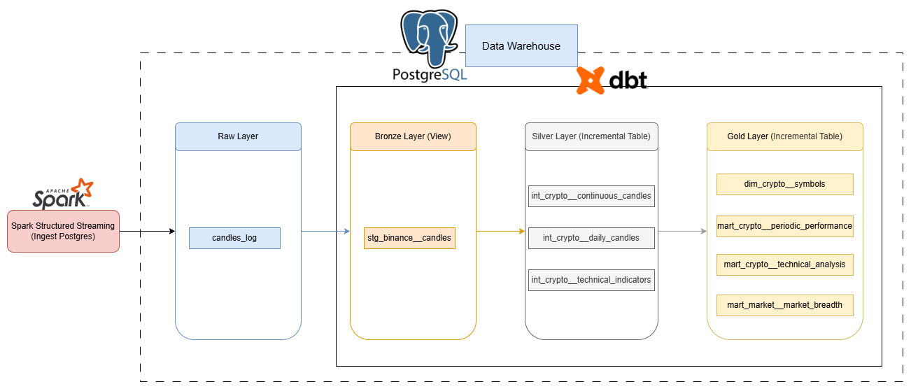
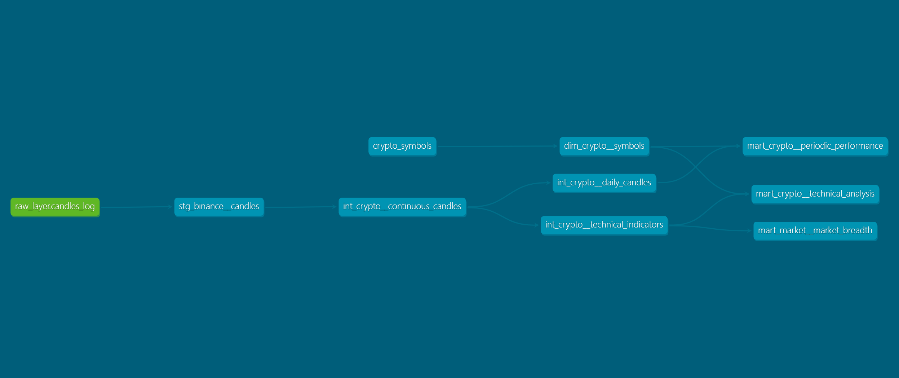
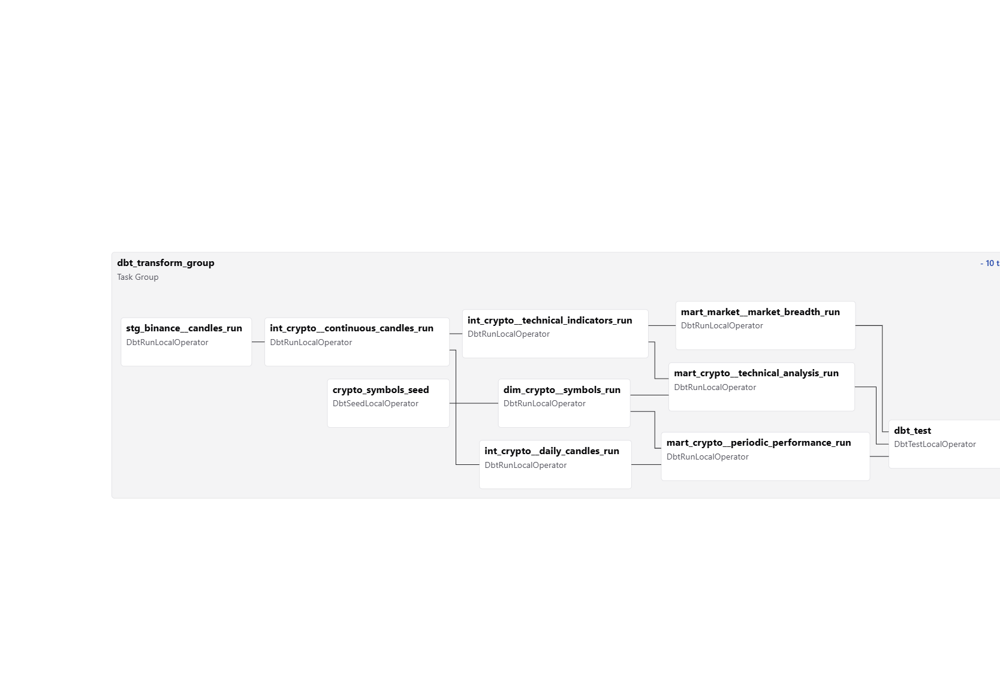
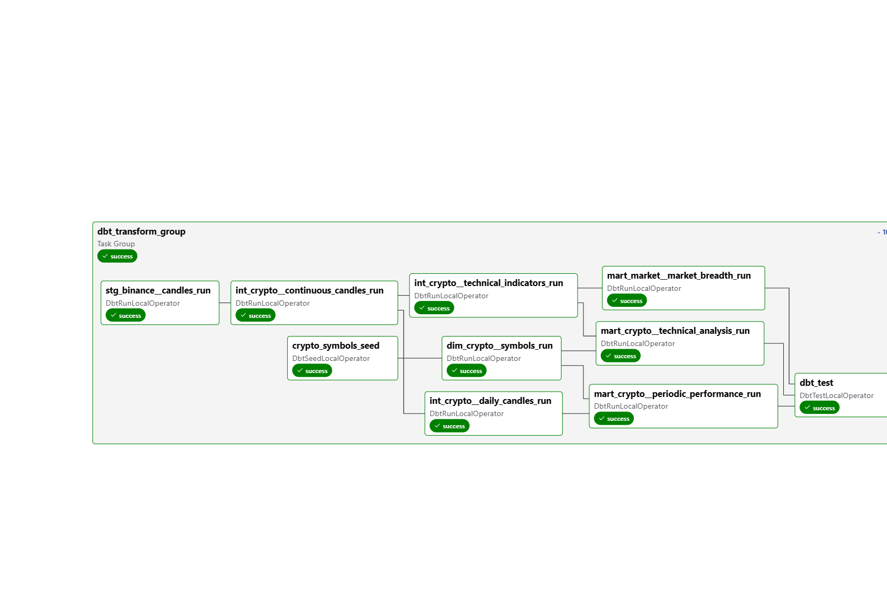

# Transformation Layer: dbt Models

> **Architecture context:** See the [Data Flow & Architecture Deep Dive](./data_flow.md) for how dbt fits into the overall pipeline.

## 1. Overview

dbt transforms raw trade data into analytics-ready tables using a **Medallion Architecture** pattern:



**Key Benefits:**
- **Incremental processing**: handle high-volume streaming data
- **Decoupling:** clear separation of data quality layers
- **Reusability**: reusable transformations via models

## 2. Medallion Architecture

### 2.1. Layer Definitions

| Layer | Schema | Materialization | Purpose |
| --- | --- | --- | --- |
| **Raw** | `raw` | Table (Spark) | Append-only from Spark Streaming |
| **Bronze** | `bronze` | View | Deduplication and initial cleaning |
| **Silver** | `silver` | Incremental Table | gap-filling, indicators, cleaning, daily basic analysis |
| **Gold** | `gold` | Incremental Table | Business logics, Final aggregated metrics for dashboards |

### 2.2. Data Flow Diagram







### 2.3. Model Dependency Chain

```
raw.candles_log (Spark)
└── stg_binance__candles (Bronze - View)
    ├── int_crypto__continuous_candles (Silver)
    │   ├── int_crypto__technical_indicators (Silver)
    │   │   ├── mart_crypto__technical_analysis (Gold) ← joins dim_crypto__symbols
    │   │   └── mart_market__market_breadth (Gold)
    │   └── int_crypto__daily_candles (Silver)
    │       └── mart_crypto__periodic_performance (Gold) ← joins dim_crypto__symbols

crypto_symbols.csv (Seed)
└── dim_crypto__symbols (Gold - Dimension)
```

## 3. Model Descriptions

### 3.1. Bronze Layer (Staging)

#### `stg_binance__candles`
* **Materialization:** View  
* **Purpose:** Deduplicates raw candle data from Spark.
* **Problem:** Spark Structured Streaming with watermarking can emit multiple records for the same window when late events arrive.
* **Solution:** Use ROW_NUMBER window function to keep only the latest record per symbol and window. The newest row (with the latest `updated_at`) will have row_num = 1

* **Key Logic:**
```sql
ROW_NUMBER() OVER (
    PARTITION BY symbol, window_start 
    ORDER BY updated_at DESC, batch_id DESC
) as row_num
...
WHERE row_num = 1
```

### 3.2. Silver Layer (Intermediate)

#### `int_crypto__continuous_candles`
* **Materialization:** Incremental  
* **Unique Key:** `candle_id`  
* **Purpose:** Creates a continuous time series with gap-filling. Solving missing data issues.
* **Problem:** If no trades occur for a symbol in a 1-minute window, there's no raw record. This creates gaps (1-minute windows) containing null.

* **Solution:** 
    1. Generate a complete time spine (1-minute intervals)
    2. Cross-join with all symbols
    3. Left-join actual data
    4. Forward-fill missing prices using the last known (non-null) close price

* **Incremental Strategy:** the 10-minute buffer handles late-arriving data.
```sql
WHERE start_time > (SELECT MAX(window_start) - INTERVAL '10 minutes' FROM {{ this }})
```

#### `int_crypto__technical_indicators`
* **Materialization:** Incremental  
* **Unique Key:** `candle_id`  
* **Purpose:** Calculates SMA and RSI indicators.

* **Indicators Calculated:**
    - `sma_5`: 5-period Simple Moving Average
    - `sma_20`: 20-period Simple Moving Average
    - `rsi_14`: 14-period Relative Strength Index


* **Incremental Strategy:** The 300-minute lookback ensures enough historical data for accurate RSI calculation (needs 14+ periods).
```sql
WHERE window_start > (SELECT MAX(window_start) - INTERVAL '300 minutes' FROM {{ this }})
```


#### `int_crypto__daily_candles`
* **Materialization:** Incremental
* **Unique Key:** `daily_candle_id`
* **Purpose:** Aggregates 1-minute candles into daily OHLCV data.
* **Incremental Strategy:** Processes only new days since the last run.
```sql
WHERE window_start >= (SELECT DATE_TRUNC('day', MAX(trade_date)) FROM {{ this }})
```

### 3.3. Gold Layer (Marts)

#### `dim_crypto__symbols`
* **Purpose:** Dimension table for cryptocurrency symbol metadata.
* **Columns:** `symbol_code`, `base_asset_name`, `quote_asset`, `exchange`, `sector`

#### `mart_crypto__technical_analysis`
* **Unique Key:** `candle_id`
* **Purpose:** Final table for the Candlestick Chart and technical analysis panels.

* **Columns:**
    - Price data: `open_price`, `highest_price`, `lowest_price`, `close_price`
    - Indicators: `sma_5`, `sma_20`, `rsi_14`
    - Signals: `signal_rsi`, `trend_direction`, `trade_recommendation`

* **Signal Logic:**
```sql
CASE 
    WHEN sma_5 > sma_20 AND rsi_14 < 30 THEN 'strong_buy'
    WHEN sma_5 < sma_20 AND rsi_14 > 70 THEN 'strong_sell'
    ELSE 'hold'
END AS trade_recommendation
```

* **Incremental Strategy:** Recalculates the last 200 minutes to ensure indicator accuracy despite late data.
```sql
WHERE window_start > (SELECT MAX(window_start) - INTERVAL '200 minutes' FROM {{ this }})
```

#### `mart_market__market_breadth`
* **Unique Key:** `window_start`
* **Purpose:** Aggregates market-level metrics for the macro dashboard.

* **Key Metrics:**
    - `total_market_volume`: Sum of all USDT trading volume
    - `btc_volume_dominance_pct`: Bitcoin's share of total volume
    - `market_breadth_pct`: % of coins trading above SMA20
    - `avg_market_rsi`: Average RSI across all coins
- `market_sentiment_state`: Categorical (Extreme Greed/Fear/Neutral)

* **Incremental Strategy:** Processes only new 1-minute windows since the last run.
```sql
WHERE window_start > (SELECT MAX(window_start) FROM {{ this }})
```

#### `mart_crypto__periodic_performance`
* **Unique Key:** `daily_candle_id`
* **Purpose:** Calculates return metrics for the Top Movers panel.
* **Key Metrics:**
    - `return_1d`, `return_7d`, `return_30d`: Percentage returns
    - `risk_interday_volatility`: 30-day price standard deviation
    - `risk_intraday_volatility`: Average daily price range

* **Incremental Strategy:** Processes only new trade dates since the last run.
```sql
WHERE trade_date >= (SELECT MAX(trade_date) FROM {{ this }})
```

## 4. Reference Data (Seeds)

#### `crypto_symbols.csv`
**Location:** `dbt/seeds/crypto_symbols.csv`  
**Purpose:** Dimension table for symbol metadata.

| Column | Description |
| --- | --- |
| `symbol_code` | Trading pair (e.g., BTCUSDT) |
| `base_asset_name` | Full name (e.g., Bitcoin) |
| `quote_asset` | Quote currency (USDT) |
| `exchange` | Source exchange (Binance) |
| `sector` | Category (Layer 1, DeFi, etc.) |

## 5. Running dbt

### Via Airflow (Recommended)
The `dbt_crypto_transform` DAG [dags/dbt_crypto_transform.py](../../dags/dbt_crypto_transform.py) runs dbt automatically on a daily schedule.

### Manual Execution
```bash
# Enter the dbt container
docker exec -it dbt_dev /bin/bash

# Run all models
dbt run

# Run specific model
dbt run --select mart_crypto__technical_analysis

# Full refresh (rebuild from scratch)
dbt run --full-refresh

# Generate documentation
dbt docs generate
dbt docs serve
```

### Testing
```bash
# Run all tests
dbt test

# Test specific model
dbt test --select stg_binance__candles
```

## 6. Incremental Strategy Details

### Why Incremental?
With streaming data, full table rebuilds are expensive. Incremental models only process new data since the last run.

### Handling Late Data
- `int_crypto__continuous_candles`: 10 minutes
- `int_crypto__technical_indicators`: 300 minutes
- `int_crypto__daily_candles`: Process only new days
- `mart_crypto__technical_analysis`: 200 minutes
- `mart_market__market_breadth`: Process only new windows
- `mart_crypto__periodic_performance`: Process only new trade dates

### When to Full Refresh
Run `dbt run --full-refresh` when:
1. Model logic changes (new columns, changed calculations)
2. Upstream schema changes
3. Data corruption detected
4. Initial deployment
