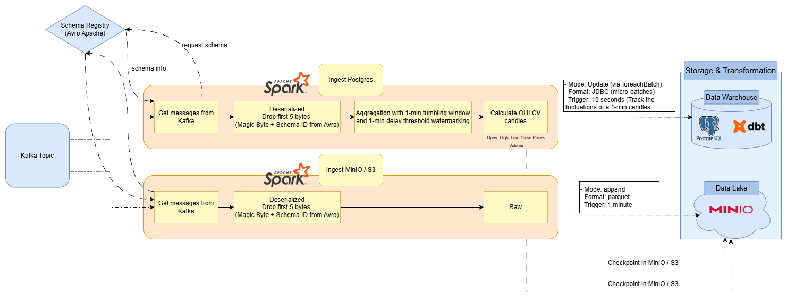

# Spark Jobs Documentation

> **Architecture context:** See the [Data Flow & Architecture Deep Dive](./data_flow.md) for how Spark fits into the overall pipeline.



## Overview

**Apache Spark Structured Streaming** acts as the consumer layer, reading from the Kafka `crypto_trades` topic, deserializing Avro messages, and writing to two storage sinks in parallel:

| Sink | Job | Purpose |
|---|---|---|
| **PostgreSQL** (Data Warehouse) | `ingest_postgres.py` | Real-time OHLCV candle aggregation for dbt transformation |
| **MinIO/S3** (Data Lake) | `ingest_minio.py` | Raw trade archival for historical analysis and backfilling |

---

## Project Structure

```
spark_jobs/
├── __init__.py
├── jobs/
│   ├── ingest_postgres.py          # OHLCV aggregation → PostgreSQL
│   └── ingest_minio.py             # Raw archival → MinIO/S3 (Parquet)
├── dependencies/
│   ├── spark_session.py            # SparkSession builder with all configs
│   ├── container.py                # Dependency Injection container
│   ├── get_schema.py               # Schema Registry REST client
│   └── connectors/
│       ├── __init__.py
│       ├── base.py                 # ABC: BaseReader, BaseWriter
│       ├── kafka.py                # KafkaReader, KafkaWriter
│       ├── postgres.py             # PostgresWriter (foreachBatch + JDBC)
│       └── minio_s3.py             # MinioS3Writer (Parquet + partitioning)
└── tests/
    └── ingest_console.py           # Console sink for local debugging
```

---

## Spark Cluster Architecture

The cluster runs in **standalone mode** with resource limits tuned for a development environment:

| Component | Memory | Cores | Notes |
|---|---|---|---|
| Spark Master | 256m (daemon) | — | Cluster manager |
| Spark Worker | 800m | 2 | Single worker node |
| Executor | 512m + 256m overhead | 2 | Runs inside the worker |
| Driver | 512m | — | Runs inside Airflow scheduler |

**Key SparkSession configurations** ([`dependencies/spark_session.py`](../../spark_jobs/dependencies/spark_session.py)):

| Config | Value | Purpose |
|---|---|---|
| `spark.sql.shuffle.partitions` | `2` | Tuned for small cluster (default 200 is too high) |
| `spark.streaming.stopGracefullyOnShutdown` | `true` | Waits for current micro-batch to finish before stopping |
| `spark.cores.max` | `2` | Limits total cores used across executors |
| `spark.ui.prometheus.enabled` | `true` | Exposes Spark metrics to Prometheus |
| `spark.sql.streaming.metricsEnabled` | `true` | Enables streaming-specific metrics |
| `spark.metrics.conf.*.sink.jmx.class` | `JmxSink` | Exports metrics via JMX for monitoring |

**JMX Monitoring:** Both driver and executor are configured with the JMX Prometheus Java Agent:
- **Driver** (port `9101`): `-javaagent:/opt/jmx_prometheus_javaagent-0.19.0.jar=9101:spark-jmx-config.yml`
- **Executor** (port `9102`): `-javaagent:/opt/jmx_prometheus_javaagent-0.19.0.jar=9102:spark-jmx-config.yml`

---

## Data Deserialization Pipeline

Both jobs share the same deserialization pipeline before diverging at the sink stage.

### 3.1. Dynamic Schema Retrieval

At runtime, Spark fetches the latest Avro schema from the Schema Registry REST API ([`dependencies/get_schema.py`](../../spark_jobs/dependencies/get_schema.py)):

```
GET http://schema-registry:8081/subjects/crypto_trades-value/versions/latest
```

### 3.2. Handling Confluent Avro in Spark

**Problem:** Spark's native `from_avro()` function expects pure Avro binary data, but Confluent's serializer prepends a 5-byte header (Magic Byte + Schema ID) that Spark cannot parse.

**Solution:** Strip the 5-byte header with a SQL expression before deserialization:

```python
from pyspark.sql.functions import expr, col
from pyspark.sql.avro.functions import from_avro

crypto_trades_schema = get_latest_schema()

parsed_df = df \
    .withColumn("fixed_value", expr("substring(value, 6, length(value)-5)")) \
    .withColumn("data", from_avro(col("fixed_value"), crypto_trades_schema)) \
    .select("data.*")
```

After deserialization, the Avro `timestamp-millis` logical type is automatically converted by Spark to `TimestampType`, making `event_time` and `processing_time` directly usable in windowing operations.

---

## Jobs

### 4.1. Data Warehouse Ingestion ([`jobs/ingest_postgres.py`](../../spark_jobs/jobs/ingest_postgres.py))

This job aggregates raw trades into **1-minute OHLCV candles** in real-time and writes them to PostgreSQL.

#### Windowing & Watermarking

```python
agg_df = parsed_df.withWatermark(eventTime="event_time", delayThreshold="1 minute") \
    .groupBy(
        window(col("event_time"), "1 minute"),
        col("symbol")
    )
```

- **Window:** 1-minute tumbling window (non-overlapping).
- **Watermark:** 1-minute delay threshold. Events arriving more than 1 minute late (relative to the latest processed event) are dropped to maintain state store efficiency.

#### OHLCV Aggregation Logic

```python
    .agg(
        expr("min_by(price, event_time)").alias("open"),   # First price in window
        max("price").alias("high"),                         # Highest price
        min("price").alias("low"),                          # Lowest price
        expr("max_by(price, event_time)").alias("close"),  # Last price in window
        sum("quantity").alias("volume"),                    # Total volume
        count("*").alias("num_trades")                     # Trade count
    )
```

| Field | Function | Description |
|---|---|---|
| `open` | `min_by(price, event_time)` | Price at the **earliest** timestamp in the window |
| `high` | `max(price)` | Highest price during the window |
| `low` | `min(price)` | Lowest price during the window |
| `close` | `max_by(price, event_time)` | Price at the **latest** timestamp in the window |
| `volume` | `sum(quantity)` | Total quantity traded |
| `num_trades` | `count(*)` | Number of individual trades |

#### Output

The aggregated DataFrame is flattened (`window.start` → `window_start`, `window.end` → `window_end`) and written to PostgreSQL:

- **Target Table:** `raw.candles_log`
- **Output Mode:** `update` — only windows that received new data are written, so a single 1-minute window updates multiple times (~6x at 10-second trigger intervals) as new trades arrive.
- **Write Method:** `foreachBatch` with JDBC `.mode("append")`. Each micro-batch is tagged with a `batch_id`.
- **Trigger:** every `10 seconds` — provides near real-time candle updates to track the fluctuations of each 1-minute window.
- **Consumer Group:** `postgres_group` — enables Kafka offset tracking and committed checkpoint coordination.
- **Checkpoint:** `s3a://crypto-data/checkpoints/ingest_postgres/crypto_candles/`

---

### 4.2. Data Lake Ingestion ([`jobs/ingest_minio.py`](../../spark_jobs/jobs/ingest_minio.py))

This job archives **raw individual trades** (no aggregation) into MinIO/S3 for historical analysis and backfilling.

#### Processing

After deserialization, the job adds a derived `event_date` column for partitioning:

```python
parsed_df = parsed_df.withColumn("event_date", expr("to_date(event_timestamp)"))
```

#### Output

- **Output Path:** `s3a://crypto-data/trades/raw/`
- **Format:** Parquet (columnar, compressed)
- **Partitioning:** `event_date` / `symbol` — enables efficient querying by date and coin
- **Output Mode:** `append` — each trigger writes new Parquet files (no updates)
- **Trigger:** every `1 minute`
- **Checkpoint:** `s3a://crypto-data/checkpoints/ingest_minio/raw`

---

### 4.3. Console Debug ([`tests/ingest_console.py`](../../spark_jobs/tests/ingest_console.py))

A test job for local development. Performs the same OHLCV aggregation as `ingest_postgres.py` but writes to the **console** instead of PostgreSQL.

- **Output Mode:** `update`
- **Trigger:** every `5 seconds`
- **Use case:** Verify deserialization, windowing, and aggregation logic without requiring PostgreSQL.

---

## Dependencies & Connectors

### 5.1. Dependency Injection — Container Pattern

The [`Container`](../../spark_jobs/dependencies/container.py) class provides **lazy-initialized connectors** via Python properties. This decouples job logic from infrastructure configuration:

```python
container = get_container(spark)
df = container.kafka_reader.read(topic=KAFKA_TOPIC, ...)
container.postgres_writer.write(df=agg_df, table_name="raw.candles_log", ...)
```

| Property | Connector | Config Source |
|---|---|---|
| `kafka_reader` | `KafkaReader` | `config.kafka.KAFKA_BOOTSTRAP_SERVERS` |
| `kafka_writer` | `KafkaWriter` | `config.kafka.KAFKA_BOOTSTRAP_SERVERS` |
| `postgres_writer` | `PostgresWriter` | `config.postgres.POSTGRES_URL/USER/PASSWORD` |
| `minio_s3_writer` | `MinioS3Writer` | S3A configured at SparkSession level |

### 5.2. Connector Details

All connectors implement `BaseReader` or `BaseWriter` (ABC) defined in [`connectors/base.py`](../../spark_jobs/dependencies/connectors/base.py).

#### Kafka Connector ([`connectors/kafka.py`](../../spark_jobs/dependencies/connectors/kafka.py))

**KafkaReader:**
- Reads from Kafka using `readStream.format("kafka")`
- Starts from `latest` offsets by default
- Supports **Consumer Groups** via `kafka.group.id` with `commitOffsetsOnCheckpoints=true`
- Optional `maxOffsetsPerTrigger` for backpressure control
- `failOnDataLoss=false` — tolerates topic compaction or missing offsets

**KafkaWriter:** Capable of writing streams back to Kafka (not yet used in production).

#### PostgreSQL Connector ([`connectors/postgres.py`](../../spark_jobs/dependencies/connectors/postgres.py))

- Uses `foreachBatch` to write each micro-batch via JDBC
- Each batch is tagged with `batch_id` (auto-assigned by Spark) for traceability
- Writes in `append` mode to `raw.candles_log`
- Trigger interval: `10 seconds`
- Error handling: logs `batch_id` on failure and re-raises for retry

#### MinIO/S3 Connector ([`connectors/minio_s3.py`](../../spark_jobs/dependencies/connectors/minio_s3.py))

- Writes streaming output to **Parquet** format
- Supports configurable `partitionBy`, `processingTime` trigger, and checkpoint location
- S3A filesystem configuration (endpoint, access/secret keys, path-style access) is set at the SparkSession level

---

## Fault Tolerance

| Mechanism | Details |
|---|---|
| **Checkpointing** | Enabled on MinIO/S3 at `s3a://crypto-data/checkpoints/`. Separate directories per job (`ingest_postgres/`, `ingest_minio/`). Stores Kafka offsets and streaming state. |
| **Restart Recovery** | On failure, Spark resumes from the last committed checkpoint offset. No data is reprocessed from scratch. |
| **Processing Guarantee** | **At-Least-Once** semantics. Combined with the deduplication logic in dbt's Bronze layer (`ROW_NUMBER()`), this achieves effective **Exactly-Once** end-to-end. |
| **Graceful Shutdown** | `stopGracefullyOnShutdown=true` — waits for the current micro-batch to complete before stopping. |

---

## Local Testing

Run Spark jobs inside the `spark-master` container:

```bash
# Step 1: Enter the container
docker exec -it spark-master bash

# Step 2a: Run PostgreSQL ingestion
spark-submit --master spark://spark-master:7077 spark_jobs/jobs/ingest_postgres.py

# Step 2b: Run MinIO ingestion
spark-submit --master spark://spark-master:7077 spark_jobs/jobs/ingest_minio.py

# Step 2c: Run console debug (for testing)
spark-submit --master spark://spark-master:7077 spark_jobs/tests/ingest_console.py
```