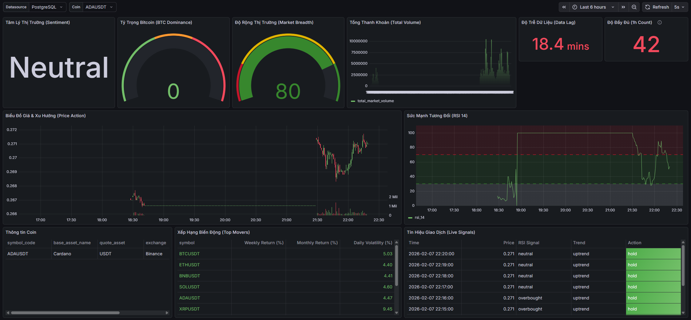

# Dashboard & Metrics Guide

This document explains the key financial metrics, technical indicators, and visualizations available on the Real-time Dashboard.

## 1. Dashboard Layout Strategy

The dashboard is organized using a **"Macro to Micro"** hierarchy.

* **Row 1: Macro View (Market Health)** - indicatie the overall sentiment, money flow; data lag and completeness.
* **Row 2: Micro View (Asset Analysis)** - Detailed price action and technical indicators for the selected cryptocurrency.
* **Row 3: Actionable Insights** - Real-time algorithmic signals and performance rankings.

## 2. Metric Definitions

### 2.1. Macro View (Row 1)

#### Market Sentiment
* **Type:** Stat
* **Description:** Represents the psychological state of the market based on the aggregation of RSI across all assets.
* **Interpretation:**
    * **Extreme Greed (> 70):** Market euphoric; high risk of correction.
    * **Greed (60 - 70):** Bullish sentiment; trend likely to continue.
    * **Neutral (40 - 60):** No clear market bias.
    * **Fear (30 - 40):** Bearish sentiment; caution advised.
    * **Extreme Fear (< 30):** Market panicked; potential buying opportunity.

#### Bitcoin Dominance
* **Type:** Gauge
* **Description:** The percentage of total market volume attributed to Bitcoin versus Altcoins.
* **Interpretation:**
    * **Rising:** Capital rotates into Bitcoin (Risk-off). Altcoins may underperform.
    * **Falling:** Capital flows into Altcoins (Risk-on). Potential "Altcoin Season".

#### Market Breadth
* **Type:** Gauge
* **Description:** The percentage of tracked assets currently trading above their 20-period SMA.
* **Interpretation:**
    * **Strong Uptrend (> 80%):** Healthy, broad-based rally.
    * **Strong Downtrend (< 20%):** Broad market collapse.
    * **Divergence:** If Bitcoin rises but Breadth falls, the rally is weak.

#### Total Volume
* **Type:** Bar Chart
* **Description:** The aggregate trading volume of all tracked assets in USDT over the selected period.
* **Interpretation:**
    * **Increasing:** High conviction in the current trend.
    * **Decreasing:** Low conviction; trend momentum is fading.

#### Data Lag
* **Type:** Stat
* **Description:** The latency (time difference) between the current moment and the latest received data point.
* **Interpretation:**
    * **Real-time (< 30s):** System is healthy; data is fresh.
    * **Delayed:** Indicates potential issues in the pipeline or API source.

#### Data Completeness (1h Count)
* **Type:** Stat
* **Description:** The count of 1-minute candlesticks received for the selected asset in the last hour (Target: 60).
* **Interpretation:**
    * **60:** Perfect data integrity.
    * **< 60:** Data gaps exist due to downtime or latency.

---

### 2.2. Micro View (Row 2)

#### Price Action & SMA
* **Type:** Candlestick
* **Description:** Displays OHLC (Open, High, Low, Close) prices overlaid with SMA 5 (Fast) and SMA 20 (Trend) lines.
* **Interpretation:**
    * **Trend Identification:** Price > SMA 20 indicates an uptrend; Price < SMA 20 indicates a downtrend.
    * **Dynamic Support/Resistance:** The SMA 20 line often acts as a bounce area during trends.

#### Relative Strength Index (RSI 14)
* **Type:** Time Series
* **Description:** A momentum oscillator that measures the speed and change of price movements.
* **Interpretation:**
    * **Overbought (> 70):** Price has risen too fast; prepare for a dip.
    * **Oversold (< 30):** Price has fallen too fast; look for a bounce.
    * **Divergence:** Discrepancy between Price and RSI direction warns of reversals.

---

### 2.3. Actionable Insights (Row 3)

#### top Movers
* **Type:** Table
* **Description:** A ranking of assets based on weekly returns, monthly returns, and daily volatility.
* **Interpretation:**
    * **High Volatility:** Identifies assets suitable for intraday trading.
    * **Top Gainers:** Identifies leaders of the current market cycle.

#### Live Signals
* **Type:** Table
* **Description:** Real-time trading recommendations generated by algorithmic logic.
* **Interpretation:**
    * **STRONG BUY:** Price > SMA20 + RSI < 30 (Dip Buy).
    * **BUY:** Price > SMA20 (Trend Follow).
    * **SELL:** Price < SMA20 (Trend Follow).
    * **STRONG SELL:** Price < SMA20 + RSI > 70 (Sell into Strength).

#### Coin Info
* **Type:** Table
* **Description:** Static reference data for the selected asset (Name, Symbol, Exchange).
* **Interpretation:** Used to verify the identity and properties of the asset being analyzed.
