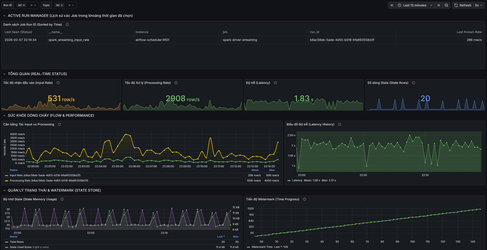
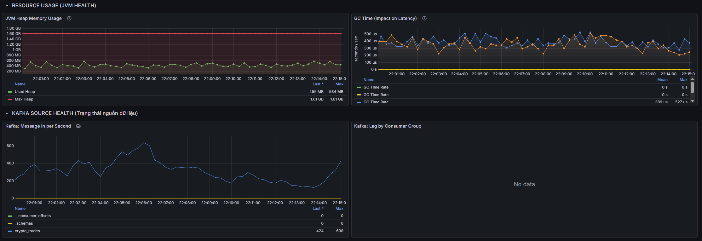
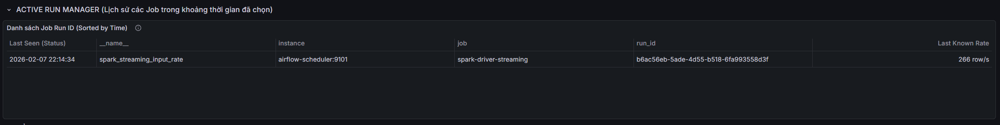
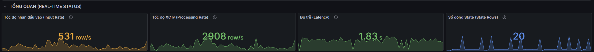
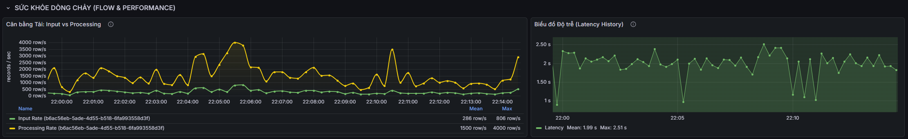
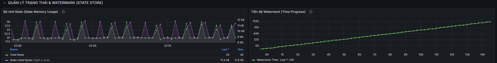
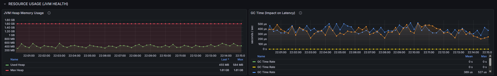
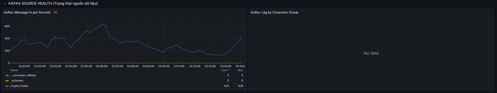

# Spark Structured Streaming - Kafka Source - JVM Monitoring Dashboard

> **Architecture context:** See [Data Flow & Architecture Deep Dive](../architecture/data_flow.md#8-monitoring-stack) for how monitoring fits into the overall pipeline.

## 1. Overview

This dashboard provides view of the data processing pipeline's health. It unifies metrics from three domains:
1.  **Spark Structured Streaming:** Spark job execution metrics.
2.  **Kafka Source:** Data ingestion (Messages Per Second) and consumer lag status.
3.  **JVM Resources:** Heap memory usage and Garbage Collection performance.

## 2. Dashboard Structure and Component Analysis

### A. Active Run Manager

#### Panel: Job Run ID List
*   **Type:** Table
*   **Purpose:** Lists all Spark `run_id` identifiers detected during the selected time range.
*   **Interpretation:**
    *   **Status Identification:** Observe the **Time (Last Seen)** column.
        *   If the timestamp matches the current time: The Job is **ACTIVE**.
        *   If the timestamp is in the past: The Job is **STOPPED** or failed.
    *   **Usage:** This ID can be used as a variable/filter for subsequent panels to isolate metrics for a specific execution session.

### B. Real-Time Status
This row displays real-time status, indicating the immediate vitality of the system.

#### Key Metrics
*   **Input Rate:**
    *   **Type:** Stat
    *   **Meaning:** The number of records read from Kafka per second.
    *   **Interpretation:** A value of 0 suggests no incoming data (idle source) or a disconnected job.
*   **Processing Rate:**
    *   **Type:** Stat
    *   **Meaning:** The number of records processed and committed by Spark per second.
*   **Latency:**
    *   **Type:** Stat
    *   **Meaning:** The end-to-end time required to process a single micro-batch.
    *   **Interpretation:** Low values (Green) indicate healthy performance. High values (Yellow/Red) indicate processing delays.
*   **State Rows:**
    *   **Type:** Stat
    *   **Meaning:** The total number of keys/records currently held in the State Store (memory) for aggregation or join operations.

### C. Flow & Performance Analysis
This row assesses the stability of data flow and processing efficiency.

#### Panel: Load Balance (Input vs Processing)
*   **Type:** Time Series
*   **Description:** A dual-line graph comparing input velocity against processing velocity.
*   **Interpretation:**
    *   **Healthy State:** The Processing line (Yellow) tracks closely with or exceeds the Input line (Green).
    *   **Warning State (Backpressure):** If the Input line consistently stays above the Processing line, the system is accumulating backlog. The micro-batches are taking longer to process than the rate of new data arrival.

#### Panel: Latency History
*   **Type:** Time Series
*   **Description:** Historical trend of batch processing duration.
*   **Interpretation:** Spikes indicate temporary instability. A continuously rising trend suggests a degrading system (e.g., resource exhaustion or external dependency issues).

### D. State Store Management
This row focuses on memory usage related to business logic (aggregations/joins).

#### Panel: State Memory Usage (Rows vs Bytes)
*   **Type:** Time Series (Dual Y-Axis)
*   **Description:** Correlates the number of rows in state (Left Axis) with the physical memory consumed (Right Axis).
*   **Interpretation:**
    *   **Memory Leak Detection:** If both lines increase monotonically over time without resetting or stabilizing, the logic may lack proper state cleanup mechanisms, or the watermark configuration may be insufficient.

#### Panel: Watermark Progress
*   **Type:** Step Chart
*   **Description:** Tracking the progression of Event Time processing.
*   **Interpretation:**
    *   **Stalled Progress:** A flat horizontal line indicates processing has hung; the system is not advancing its internal clock, potentially ignoring late data or failing to trigger window expirations.

### E. Resource Usage (JVM Health)
Monitoring the underlying Java Virtual Machine allows for prediction of crashes and performance degradation.

#### Panel: JVM Heap Memory Usage
*   **Type:** Time Series
*   **Description:** Comparison of Used Heap (Green) versus Max Heap Capacity (Red).
*   **Interpretation:**
    *   **OOM Risk:** If Used Heap consistently operates near the Max Heap limit (> 85-90%), the application is at high risk of an Out Of Memory (OOM) crash.

#### Panel: GC Time (Garbage Collection)
*   **Type:** Time Series
*   **Description:** Time spent pausing execution to reclaim memory.
*   **Interpretation:**
    *   **Stop-the-world problems:** High GC times (e.g., > 0.1s/sec average) imply the system is struggling to manage memory, directly increasing Batch Latency.

### F. Kafka Source Health
Independent monitoring of the message broker status.

#### Metrics
*   **Message In per Second:** The rate of messages publishing to the topic, unrelated to Spark's consumption.
*   **Lag by Consumer Group:** The delta between the latest offset in Kafka and the last committed offset by Spark. High lag confirms the consumer cannot keep up with production.

> **Note:** For Spark Structured Streaming, offset management is handled internally via checkpoints in MinIO (S3). Therefore, the lag metric can not be assessed by kafka-exporter and may show "No Data" or zero lag. Instead, monitor Spark's Input vs Processing rates to assess consumption health.

> **Future Plan:** Implement script that read offsets from MinIO checkpoints and offsets from Kafka to calculate true consumer lag for Spark jobs.